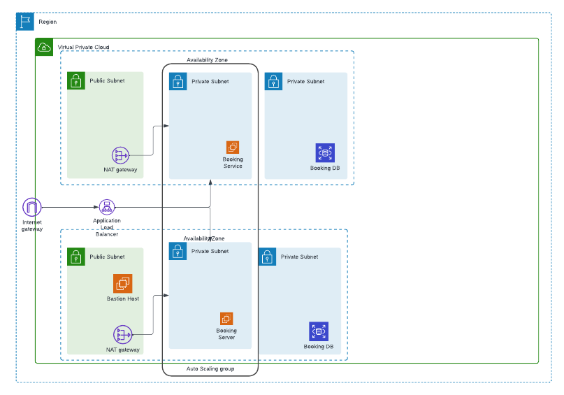
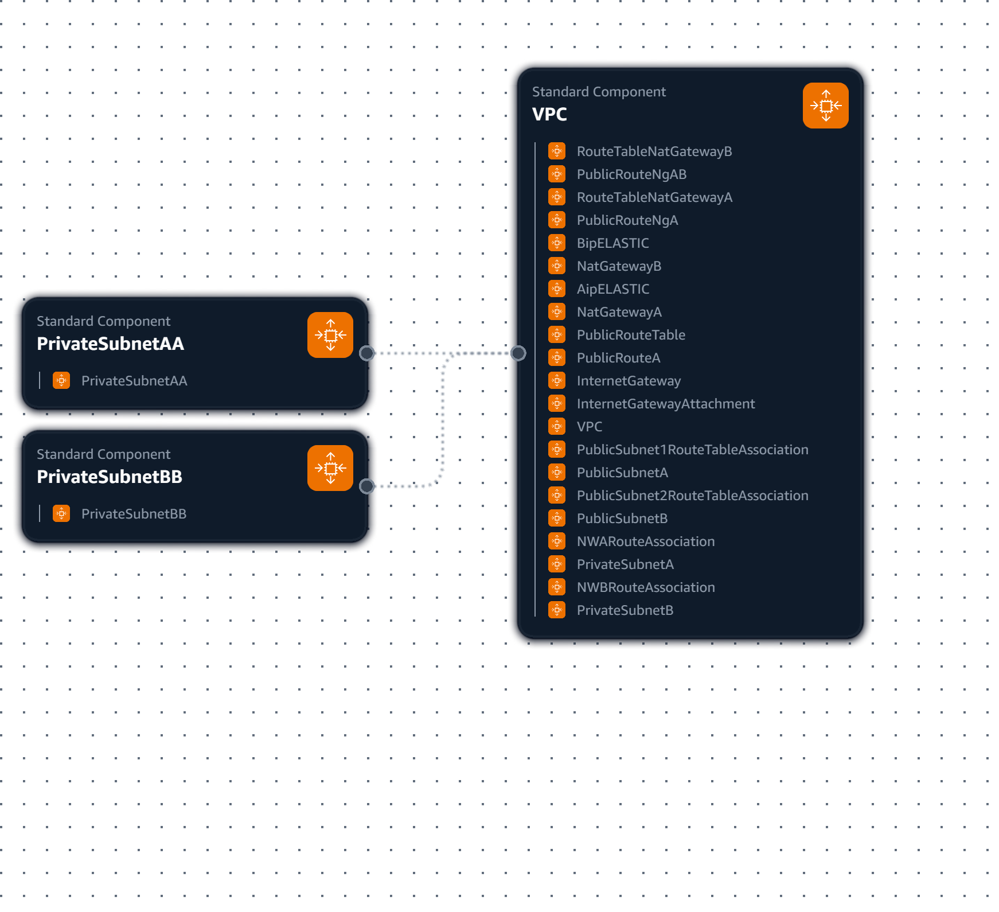

<h1 align="center"> Proyecto AWS - El mundo de las Letras</h1>

<h3>
    Bienvenidos a nuestro proyecto. Elaborado por Jose Navarro | Julio | Andres Garcias donde diseñamos e implementamos una arquitectura basada en la nube utilizando Amazon Web Services (AWS). Este proyecto tenía como objetivo crear una infraestructura escalable, segura y eficiente para implementar modelos de aprendizaje profundo. A través de este proyecto, demostré mis habilidades en computación en la nube, diseño de arquitectura y prácticas de DevOps.En este repositorio encontrarás una documentación detallada de mi proyecto basada en AWS Well-Architected, incluyendo las fases de planificación, ejecución y seguimiento. Utilicé servicios de AWS como CloudFormation, Pipeline y CloudWatch para diseñar e implementar una arquitectura sólida y confiable. Además, seguímos el marco de buena arquitectura de AWS para garantizar las prácticas recomendadas en seguridad, rendimiento y optimización de costos.</h3>

> [!IMPORTANT]
> <h2> 1. Requerimientos </h2>

<table>
    <tr>
      <th>Requisito</th>
      <th>Descripción</th>
    </tr>
    <tr>
      <td>1. Creación de VPC</td>
      <td>Creación de una VPC con un bloque CIDR específico y habilitación de nombres de host DNS.</td>
    </tr>
    <tr>
      <td>2. Conectividad a Internet</td>
      <td>Conectividad a Internet a través de una puerta de enlace de Internet (IG) adjunta a la VPC.</td>
    </tr>
    <tr>
      <td>3. Creación de tablas de rutas</td>
      <td>Creación de tablas de rutas públicas y privadas para enrutar tráfico hacia las subredes correspondientes.</td>
    </tr>
    <tr>
      <td>4. Uso de puertas de enlace NAT</td>
      <td>Uso de puertas de enlace NAT para permitir que las instancias en subredes privadas accedan a Internet.</td>
    </tr>
    <tr>
      <td>5. Asignación de direcciones IP elásticas</td>
      <td>Asignación de direcciones IP elásticas a las puertas de enlace NAT.</td>
    </tr>
    <tr>
      <td>6. Creación de subredes</td>
      <td>Creación de subredes públicas y privadas con bloques CIDR específicos.</td>
    </tr>
    <tr>
      <td>7. Asociación de tablas de rutas</td>
      <td>Asociación de tablas de rutas con subredes correspondientes.</td>
    </tr>
    <tr>
      <td>8. Creación de grupos de seguridad</td>
      <td>Creación de grupos de seguridad para controlar el tráfico hacia las instancias y recursos.</td>
    </tr>
    <tr>
      <td>9. Configuración de reglas de seguridad</td>
      <td>Configuración de reglas de seguridad para permitir el tráfico SSH, HTTP y MySQL entre los grupos de seguridad.</td>
    </tr>
    <tr>
      <td>10. Creación de Launch Template</td>
      <td>Creación de un Launch Template para lanzar instancias con configuración específica.</td>
    </tr>
    <tr>
      <td>11. Creación de Target Group</td>
      <td>Creación de un Target Group para enrutar tráfico hacia instancias específicas.</td>
    </tr>
    <tr>
      <td>12. Configuración de Auto Scaling Group</td>
      <td>Configuración de un Auto Scaling Group para escalar instancias según la demanda.</td>
    </tr>
    <tr>
      <td>13. Creación de instancia pública</td>
      <td>Creación de una instancia pública con configuración específica.</td>
    </tr>
    <tr>
      <td>14. Creación de Application Load Balancer (ALB)</td>
      <td>Creación de un Application Load Balancer (ALB) para distribuir tráfico hacia instancias.</td>
    </tr>
    <tr>
      <td>15. Configuración de Listener</td>
      <td>Configuración de un Listener para enrutar tráfico hacia el Target Group.</td>
    </tr>
    <tr>
      <td>16. Creación de política de escalado</td>
      <td>Creación de una política de escalado para ajustar la capacidad del Auto Scaling Group según la utilización de CPU.</td>
    </tr>
  </table>

<ul>
    <li>Aplicacion en Python 3</li>
    <li>Base de Datos en MariaDB</li>
    <li>Etiquetado de recursos con nombres descriptivos para facilitar la identificación y gestión.</li>
    <li>Uso de nombres de host DNS habilitados para facilitar la resolución de nombres.</li>
    <li>Uso de puertas de enlace NAT para proteger las instancias en subredes privadas.</li>
    <li>Creación de múltiples subredes y puertas de enlace NAT para admitir un crecimiento futuro.</li>
    <li>Uso de nombres descriptivos y configuración de recursos para facilitar la gestión y mantenimiento de la infraestructura.</li>
</ul>

> [!IMPORTANT]
> <h3> A continuación, se presentan los roles y perfiles definidos mediante el servicio IAM. </h3>

<ul>
    <li>Administrador de nube y servidores: posee derechos de administración totales, con acceso a todos los recursos de AWS.</li>
    <li>Desarrollador: cuenta con acceso restringido solo a AWS Cloud9, sin permisos adicionales.</li>
    <li>Administrador de servidor Web y Base de Datos: tiene acceso completo a Amazon EC2, RDS y System Manager (Parameter Store), permitiéndole administrar y configurar los recursos correspondientes.    </li>
    <li>Equipo de soporte de Almacenamiento: solo puede visualizar los buckets creados en S3, sin permisos de escritura o edición.</li>
    <li>Usuario de Consulta: tiene acceso de solo lectura a Amazon EC2 y RDS, permitiéndole consultar y visualizar la información, pero sin capacidad de realizar cambios o modificaciones.</li>
    <li>Auditor: cuenta con acceso de solo lectura a Amazon EC2, RDS e IAM, permitiéndole revisar y auditar la configuración y los recursos, pero sin capacidad de modificarlos.
    </li>
</ul>

> [!IMPORTANT]
> Diagrama Arquitectura

> [!NOTE]
> Seguimiento y Control Basado en AWS Well-Architected Framework

<h2 align="center"> Template Network</h2>

<h3>Excelencia Operativa</h3>
<table>
    <tr>
        <th>Requisito</th>
        <th>Descripción</th>
    </tr>
    <tr>
        <td>VPC</td>
        <td>Configurado con un bloque CIDR predeterminado y nombres de host DNS habilitados, lo que demuestra una
            configuración de infraestructura bien planificada y ejecutada.</td>
    </tr>
    <tr>
        <td>RouteTables</td>
        <td>Se crean varias tablas de rutas para subredes públicas y privadas, lo que garantiza un enrutamiento y una
            gestión de red eficientes.</td>
    </tr>
    <tr>
        <td>Asociación de tablas de rutas</td>
        <td>Las tablas de rutas están asociadas a las subredes correctas, lo que garantiza que el tráfico se enrute de
            forma correcta y eficiente.</td>
    </tr>
</table>
    
<h3>Seguridad</h3>
<table>
    <tr>
        <th>Requisito</th>
        <th>Descripción</th>
    </tr>
    <tr>
        <td>VPC</td>
        <td>La VPC está configurada con un bloque CIDR predeterminado, que ayuda a evitar el acceso no autorizado a la
            red.</td>
    </tr>
    <tr>
        <td>InternetGateway</td>
        <td>La puerta de enlace de Internet está conectada a la VPC, lo que proporciona un punto de entrada y salida
            seguro para el tráfico de Internet.</td>
    </tr>
    <tr>
        <td>NAT Gateway</td>
        <td>Se crean dos puertas de enlace NAT, cada una con su propia dirección IP elástica, lo que proporciona una
            forma segura y escalable de acceder a Internet desde subredes privadas.</td>
    </tr>
</table>
    
<h3>Fiabilidad</h3>
<table>
    <tr>
        <th>Requisito</th>
        <th>Descripción</th>
    </tr>
    <tr>
        <td>NAT Gateway</td>
        <td>Se crean dos puertas de enlace NAT, lo que proporciona redundancia y garantiza que, si una puerta de enlace
            falla, la otra pueda seguir proporcionando acceso a Internet a subredes privadas.</td>
    </tr>
    <tr>
        <td>RouteTable</td>
        <td>Se crean varias tablas de rutas, lo que proporciona redundancia y garantiza que si una tabla de rutas falla,
            la otra puede continuar enrutando el tráfico correctamente.</td>
    </tr>
    <tr>
        <td>Subredes</td>
        <td>Se crean seis subredes, que proporcionan una infraestructura de red escalable y flexible que puede adaptarse
            a las necesidades cambiantes del negocio.</td>
    </tr>
</table>
    
<h3>Optimización del rendimiento</h3>
<table>
    <tr>
        <th>Requisito</th>
        <th>Descripción</th>
    </tr>
    <tr>
        <td>Subredes</td>
        <td>Se crean seis subredes, cada una con su propio bloque CIDR, lo que proporciona una infraestructura de red
            escalable y flexible que puede adaptarse a las necesidades cambiantes del negocio.</td>
    </tr>
    <tr>
        <td>NAT Gateway</td>
        <td>Se crean dos puertas de enlace NAT, cada una con su propia dirección IP elástica, lo que proporciona una
            forma escalable y eficiente de acceder a Internet desde subredes privadas.</td>
    </tr>
    <tr>
        <td>Tablas de rutas</td>
        <td>Se crean varias tablas de rutas, lo que proporciona una gestión eficiente del enrutamiento y la red.</td>
    </tr>
</table>

<h3>Optimización de costos</h3>
<table>
  <tr>
    <th>Requisito</th>
    <th>Descripción</th>
  </tr>
  <tr>
    <td>VPC</td>
    <td>La VPC está configurada con un bloque CIDR predeterminado, que ayuda a optimizar los recursos de la red y reducir los costos.</td>
  </tr>
  <tr>
    <td>NAT Gateway</td>
    <td>Se crean dos puertas de enlace NAT, cada una con su propia dirección IP elástica, lo que proporciona una forma rentable de acceder a Internet desde subredes privadas.</td>
  </tr>
  <tr>
    <td>Subredes</td>
    <td>Se crean seis subredes, cada una con su propio bloque CIDR, que proporcionan una infraestructura de red rentable y escalable que puede adaptarse a las necesidades cambiantes del negocio.</td>
  </tr>
</table>

